To guide the user through the functionalities of the `CoMiRe` package, we use a subset of the US Collaborative Perinatal Project (CPP) data. Specifically we focus on studying the effect of Dichlorodiphenyldichloroethylene (DDE) on premature delivery [(Longnecker et al., 2001)](http://www.thelancet.com/journals/lancet/article/PIIS0140673601053296/abstract).

Load data and packages
======================

Load the CoMiRe set of functions of the `CoMiRe` package

``` r
library(CoMiRe)
```

    ## Warning: replacing previous import 'vctrs::data_frame' by 'tibble::data_frame'
    ## when loading 'dplyr'

``` r
library(splines2)
library(ggplot2)
library(gridExtra)
library(KernSmooth)
```

Load the CPP data

``` r
data(CPP)
attach(CPP)
```

The DDE has a clear effect in determining premature births as can be seen from

``` r
ggplot(data=CPP) + geom_point(aes(x=dde, y=gestage), alpha=.5, cex=.5) + 
  geom_smooth(aes(x=dde, y=gestage), method="loess", span = 1, col=1) + 
  xlab("Dichlorodiphenyldichloroethylene (DDE)") + ylab("Gestational age at delivery") + theme_bw()
```

    ## `geom_smooth()` using formula 'y ~ x'

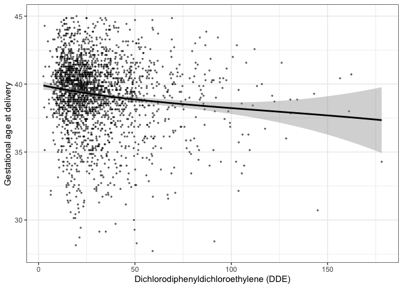

CoMiRe for dichotomous responses
================================

To provide a first assessment of the risk of DDE exposure, we fit a simple logistic model to the dichotimized outcome, i.e. we classify a birth as premature if it occurs before 37 weeks.

``` r
premature <- as.numeric(gestage <= 37)
glmfit<- glm(premature ~ dde, family="binomial")
summary(glmfit)
```

    ## 
    ## Call:
    ## glm(formula = premature ~ dde, family = "binomial")
    ## 
    ## Deviance Residuals: 
    ##     Min       1Q   Median       3Q      Max  
    ## -1.3003  -0.6011  -0.5566  -0.5242   2.0835  
    ## 
    ## Coefficients:
    ##              Estimate Std. Error z value Pr(>|z|)    
    ## (Intercept) -2.095757   0.100314 -20.892  < 2e-16 ***
    ## dde          0.014665   0.002437   6.018 1.76e-09 ***
    ## ---
    ## Signif. codes:  0 '***' 0.001 '**' 0.01 '*' 0.05 '.' 0.1 ' ' 1
    ## 
    ## (Dispersion parameter for binomial family taken to be 1)
    ## 
    ##     Null deviance: 2069.7  on 2312  degrees of freedom
    ## Residual deviance: 2035.6  on 2311  degrees of freedom
    ## AIC: 2039.6
    ## 
    ## Number of Fisher Scoring iterations: 4

We now use the CoMiRe approach for the binary response `preature`. We fist specify the MCMC settings and elicit the prior parameters. Specifically, for *π*<sub>0</sub> we assume a beta distribution, *π*<sub>0</sub> ∼ *B**e**t**a*(*a*<sub>*π*<sub>0</sub></sub>, *b*<sub>*π*<sub>0</sub></sub>) with *a*<sub>*π*<sub>0</sub></sub> = 27 and *b*<sub>*π*<sub>0</sub></sub> = 360 so that the prior expectation of *π*<sub>0</sub> is roughly 0.07, and the prior probability of obtaining *π*<sub>0</sub> ≤ 0.05 is very low, i.e. *P**r*(*π*<sub>0</sub> &lt; 0.05)=0.05. This is consistent with the prior information on the expected proportion of preterm births in developed countries and the inferior preterm birth rate reported by [Beck et al. (2009)](https://pubmed.ncbi.nlm.nih.gov/20428351/).

``` r
J <- 10
prior <- list(eta=rep(1, J)/J, a.pi0=27, b.pi0=360, J=J)
mcmc <- list(nrep=5000, nb=2000, thin=5, ndisplay=4)
```

Now we are ready to run the MCMC, specifying `family = 'binary'` and providing the `comire.gibbs` function all the necessary arguments:

``` r
fit1<- comire.gibbs(y=premature, x=dde, family='binary', mcmc=mcmc, 
                            prior=prior, seed=5, max.x=180)
```

    ## CoMiRe model fit via Gibbs Sampler
    ## Family: binary
    ## Burn in done
    ## 3250 iterations over 7000 
    ## 4500 iterations over 7000 
    ## 5750 iterations over 7000 
    ## 7000 iterations over 7000

The output of `comire.gibbs` is an object of the class `classCoMiRe`. Standard methods like `print` or `summary` are available:

``` r
class(fit1)
```

    ## [1] "classCoMiRe"

``` r
print(fit1)
```

    ## CoMiRe model fit via Gibbs Sampler
    ## Family: Binary

``` r
summary(fit1)
```

    ## CoMiRe model fit via Gibbs Sampler
    ## Family: Binary
    ## Formula: premature ~ . | beta(dde)
    ## Posterior approximation based on 5000 iterations

### Posterior predictive check

Posterior predictive checks can be performed with the function `post.pred.check`. If the `classCoMiRe` object `fit` has been fitted with `family = 'binary'` the posterior predictive check consists of a plot of the smoothed empirical proportion of events (black line) and of the smoothed empirical proportion of data simulated from the posterior predictive distribution (grey lines). The parameter `oneevery` determines how many datasets from the posterior predictive distribution need to be plotted.

``` r
post.pred.check(y=premature, x=dde, fit=fit1, bandwidth = 20, mcmc=mcmc, H=10, 
                max.x=max(dde), xlim=c(0,180), oneevery = 50)
```

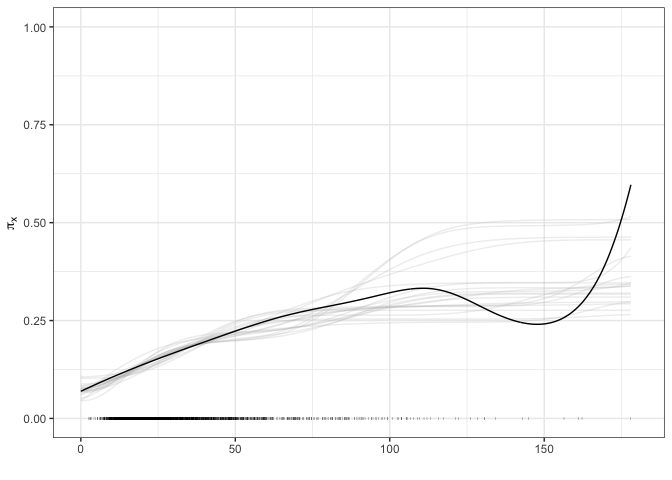

### Inference on the interpolating function

The posterior mean and credible bands of the *β*(*x*) can be obtained with

``` r
x.grid <- seq(0, max(dde), length=100)
betaplot(x=dde, fit=fit1, x.grid=seq(0,180, length=100), xlim=c(0,150))
```

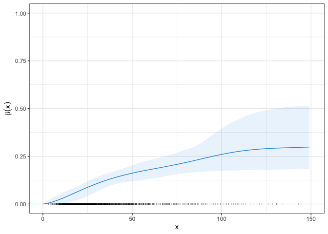

Note that for binary data, the function *β*(*x*) can be directly interpreted as the extra risk function

\begin{equation}
r_e(x) = \frac{\pi_x - \pi_0}{1 - \pi_0} = \frac{\{1-\beta(x)\}\pi_0 + \beta(x)\pi_1 - \pi_0}{1 - \pi_0} = \frac{(1 - \pi_0)\beta(x)}{1 - \pi_0} = \beta(x).
\end{equation}
### Inference for the Benchmark dose

For binary data, the benchmark dose (BMD**<sub>*q*</sub>) is defined as that dose related to a *q* increase in risk. We can obtained the BMD**<sub>*q*</sub> for a grid of values of *q* with

``` r
index <- c((mcmc$nb+1):(mcmc$nrep+mcmc$nb))[1:((mcmc$nrep)/mcmc$thin)*mcmc$thin]
bmd.data <- BMD(seq(0,.20, length=50), fit1$mcmc$beta[index,], 
                x=seq(0,max(dde), length=100), alpha=0.05)
bmd.plot(bmd.data) 
```

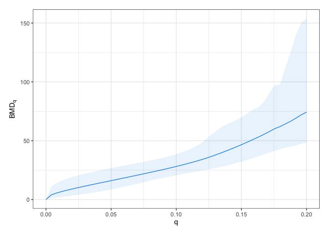

### Plot method

To have a general view of the uotput of the analysis, the method `plot()` automatically produces a list of `ggplot2` plots:

``` r
final.plot<- plot(fit1, y=gestage, xobs=dde, mcmc=mcmc, xlim=c(0,150), J=10, H=10, 
                  x.grid=x.grid, risk=TRUE, bmd=TRUE, level=seq(0,.20, length=50) ) 

pdp::grid.arrange(final.plot[[1]],final.plot[[2]],final.plot[[3]], ncol=3, nrow=1)
```

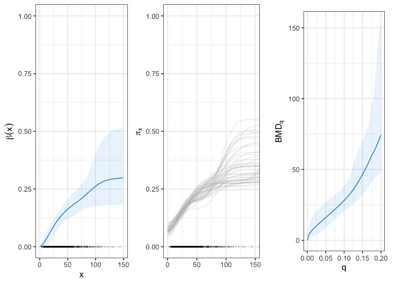

CoMiRe for continuous responses
===============================

We now fit the original CoMiRe specification for the general case in which *y* is continuous response. We restrict the attention to the simplest case in which the distribution of *y* depends on *x* only, and no confounding variablbes are included in the model. We fix the following default prior parameters

``` r
H <- 10
prior <- list(mu.theta=mean(gestage), k.theta=10, eta=rep(1, J)/J, alpha=rep(1,H)/H, 
              a=2, b=2, J=J, H=H)
```

To run the MCMC sampling use the following code. Note that `family = 'continuous'` is the default value and could be omitted.

``` r
fit2 <- comire.gibbs(gestage, dde, family="continuous", mcmc = mcmc, prior = prior,
                            seed = 5, max.x = 180)
```

    ## CoMiRe model fit via Gibbs Sampler
    ## Family: continuous
    ## Burn in done
    ## 3250 iterations over 7000 
    ## 4500 iterations over 7000 
    ## 5750 iterations over 7000 
    ## 7000 iterations over 7000

``` r
summary(fit2)
```

    ## CoMiRe model fit via Gibbs Sampler
    ## Family: Continuous
    ## Formula: gestage ~ . | beta(dde)
    ## Posterior approximation based on 5000 iterations

### Posterior predictive check

Before assessing the performance in estimating the additional risks and benchmark doses, as done for the binary case, we check the model adequacy in terms of goodness of fit. The function `post.pred.check` when `famnily = 'continuous'` draws smoothed empirical estimates of *F*<sub>*x*</sub>(*a*) from the corresponding posterior predictive distribution along with the related quantity computed on the observed data. Consistently with the definition of premature delivery we set *a* = 37.

``` r
post.pred.check(y = gestage, x = dde, fit = fit2, mcmc = mcmc, J = 10, H = 10, a = 37, 
                max.x = max(dde), xlim = c(0,150))
```

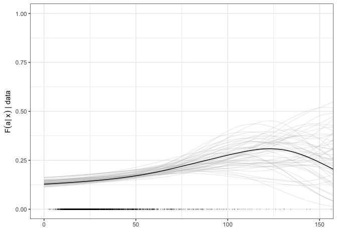

### Marginal densities estimation

We now compute the pointwise posterior mean and credible intervals of the response densities for different values of the exposure. Specifically, we first divide the observed data into bins with

``` r
break.points <- c(0, 15,30,45,60, 75, 180)
x.cpoints <- c(7.5, 22.5,37.5,52.5,67.5, 125)
groups <- as.numeric(cut(dde, breaks = break.points))
xlab <- c("Gestational age at delivery (DDE<15)",
          "Gestational age at delivery (15<DDE<30)",
          "Gestational age at delivery (30<DDE<45)",
          "Gestational age at delivery (45<DDE<60)",
          "Gestational age at delivery (60<DDE<75)",
          "Gestational age at delivery (DDE>75)")
```

Then the pointwise posterior mean and credible intervals of the response densities for *x* in `x.cpoints` can be obtained with

``` r
plot.fit <- fit.pdf.mcmc(y = gestage, x = dde, fit = fit2, mcmc = mcmc, J = 10, H = 10, 
                               alpha = 0.05, max.x = max(dde), x.val = x.cpoints, 
                               xlim = c(25,48), ylim = c(0,0.25),
                               xlab = xlab)
pdp::grid.arrange(plot.fit[[1]], plot.fit[[2]], plot.fit[[3]], plot.fit[[4]],
                  plot.fit[[5]], plot.fit[[6]], ncol=3, nrow=2)
```

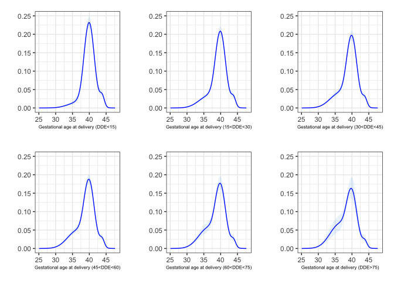

### Inference on the interpolating function

The posterior mean and the 95% credible bands of the *β*(*x*) can be obtained with

``` r
betaplot(x=dde, fit=fit2, x.grid=seq(0,180, length=100), xlim=c(0,150))
```

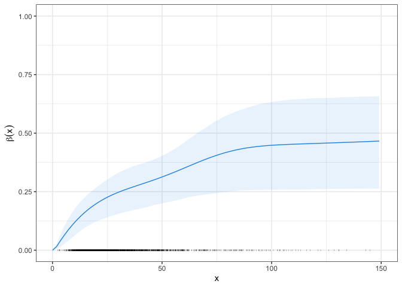

The plot highlights a notable increment in the probability of the most adverse health profile at low-dose exposures.

### Inference on the additional risk and benchmark dose

To perform quantitative risk assessment via the additional risk function, we consider again the standard preterm threshold *a* = 37. To obtain the additional risk function for a given threshold use the `add.risk()` function and plot it via `riskplot()`.

``` r
risk.data <- add.risk(y = gestage, x = dde, fit = fit2, mcmc = mcmc, a = 37,
                      x.grid = seq(0, max(dde), length = 100))
riskplot(risk.data$summary.risk, xlab="Dichlorodiphenyldichloroethylene (DDE)",
         x = dde, xlim = c(0,150)) 
```

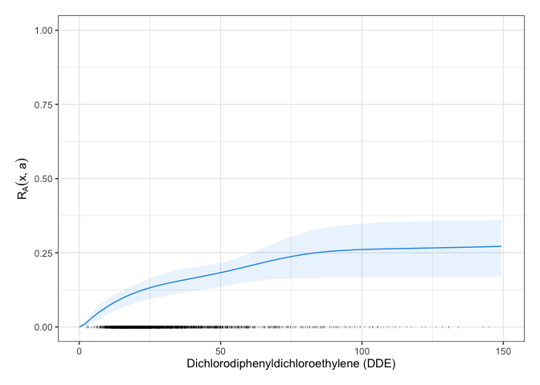

The notable increment of the additional risk at low-dose exposures suggests conservative benchmark doses. This can be confirmed by looking at the BMD**<sub>*q*</sub> expressed as a function of *q*. The latter can be obtained with the function `BMD()` which extracts estimates of the benchmark dose related to a given risk function for different values of risk *q*.

A graphical representation of the BMD**<sub>*q*</sub> for the different values of *q* can be obtained with

``` r
bmd.data <- BMD(seq(0,.20, length=50), risk.data$mcmc.risk, 
                x=seq(0,max(dde), length=100), alpha=0.05)
bmd.plot(bmd.data) 
```

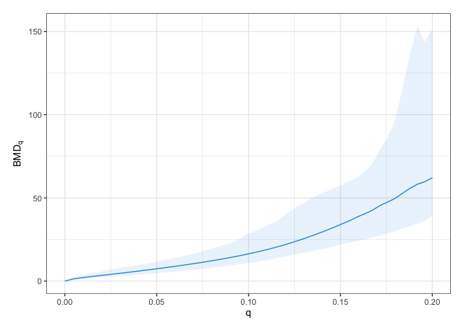

where the solid line represents the posterior mean of the BMD**<sub>*q*</sub> and the shaded areas the related 95% credible bands.

Typical values of q are 1%, 5%, and 10%. The next table reports both the BMD**<sub>*q*</sub>, estimated via the posterior mean, and the benchmark dose limit (BMDL**<sub>*q*</sub>), estimated with the lower 5% quantile of the posterior distribution of the benchmark dose.

``` r
q.values <- c(1,5,10)/100
BMDq <- BMD(q.values, risk.data$mcmc.risk, x=seq(0,max(dde), length=100), alpha=.1)
knitr::kable(BMDq[c(1,2,5)], digits = 2)
```

|     q|    BMD|   BMDL|
|-----:|------:|------:|
|  0.01|   2.12|   1.55|
|  0.05|   7.40|   5.27|
|  0.10|  16.38|  12.34|

### Plot method

As for the binary case, the standard method `plot()` returns a summary of the plots on the posterior predictive checks, on the interpolating function *β*(*x*), and on the additional risk and benchmark dose.

``` r
final.plot<- plot(fit2, y = gestage, xobs = dde, mcmc = mcmc, J = 10, H = 10, a = 37,
                  max.x = max(dde), xlim = c(0, 150), bandwidth = 20, x.grid = NULL,
                  ylim = c(0,1), xlab = "x", risk = TRUE, bmd = TRUE, 
                  level = seq(0,.20, length = 50))

pdp::grid.arrange(final.plot[[1]], final.plot[[2]], final.plot[[3]],
                  final.plot[[4]], ncol=2, nrow=2)
```

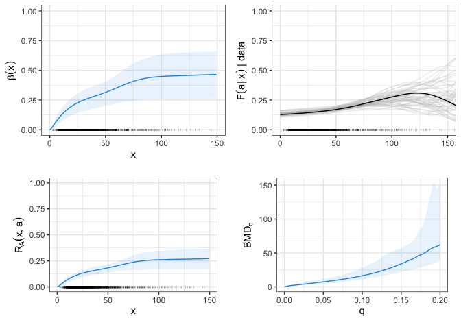

CoMiRe for continuous responses, controlling for confunders
===========================================================

We now specify a CoMiRe model that inclludes a linear dependence on some confunding factors. Speficically for the CPP data, we focus on the following confunders: age of the mother, BMI of the mother, socioeconomic index and smoking status of the mother. First of all, we standardize the covariate:

``` r
Z <- cbind(mage, mbmi, sei)
Z <- scale(Z, center = T, scale = T)
Z <- as.matrix(cbind(Z, CPP$smoke))
colnames(Z) <- c("age", "BMI", "sei", "smoke")
```

We then fix the prior paramters and the mcmc settings. Note that we use the OLS estimates to center the prior for the coefficients associated to the confunders.

``` r
mod <- lm(gestage ~ dde + Z)
prior <- list(mu.theta = mod$coefficients[1], k.theta = 10,
              mu.gamma = mod$coefficients[-c(1, 2)], sigma.gamma = diag(rep(10, 4)),
              eta = rep(1, J)/J, alpha = 1/H, a = 2, b = 2, H = H, J = J)
```

We run the MCMC with

``` r
fit3 <- comire.gibbs(y = gestage, x = dde, z = Z, family = "continuous", mcmc = mcmc, 
                          prior = prior, seed = 5)
```

    ## CoMiRe model fit via Gibbs Sampler
    ## Family: continuous 
    ## Burn in done
    ## 3250 iterations over 7000 
    ## 4500 iterations over 7000 
    ## 5750 iterations over 7000 
    ## 7000 iterations over 7000

``` r
summary(fit3)
```

    ## CoMiRe model fit via Gibbs Sampler
    ## Family: Continuous
    ## Formula: gestage ~ age + BMI + sei + smoke | beta(dde)
    ## Posterior approximation based on 5000 iterations

All the previous functionalities are also implemented for a CoMiRe model including linear dependence on confunding factors. For example, the model's goodness of fit can be inspected via posterior predictive checks:

``` r
post.pred.check(y = gestage, x = dde, fit = fit3, mcmc=mcmc, J = 10, H=10, a=37, xlim=c(0,150), bandwidth = 50)
```

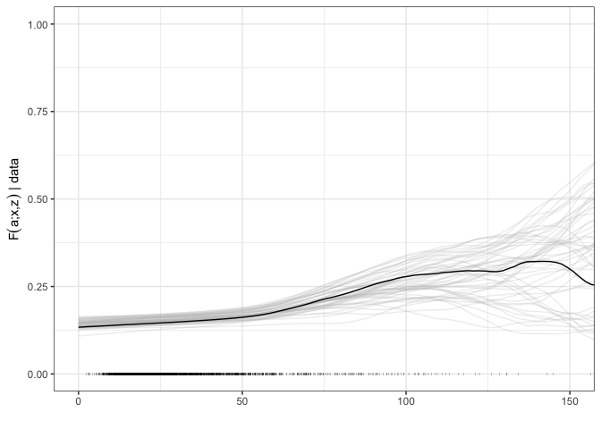

Pointwise posterior mean and credible intervals of the response densities for different values of *x* and for a fixed value of the confoundig covariate *z* (default value is `mean(z)` for a numeric covariate and the mode of `z` for a categorical covariate) can also be obtained. The pointwise posterior mean and credible intervals of the response densities for *x* in `x.cpoints` can be obtained with

``` r
plot.fit <- fit.pdf.mcmc(y = gestage, x = dde, fit = fit3, mcmc = mcmc, J = 10, H = 10,
                        max.x = max(dde), xlim = c(25,48), x.val = x.cpoints,
                        ylim = c(0,0.25), xlab = xlab)
pdp::grid.arrange(plot.fit[[1]], plot.fit[[2]], plot.fit[[3]], plot.fit[[4]],
                  plot.fit[[5]], plot.fit[[6]], ncol=3, nrow=2)
```

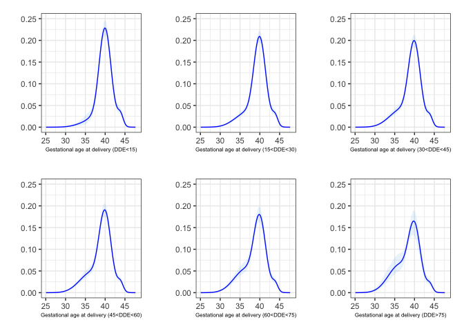

The standard method `plot()` can be used consistently with the previous cases:

``` r
final.plot <- plot(fit3, y = gestage, xobs = dde, mcmc = mcmc, J = 10, H = 10, 
                   a = 37, max.x = max(dde), 
                  xlim = c(0, 150), bandwidth = 50, x.grid = NULL, ylim = c(0,1), xlab = "x",
                  risk = TRUE, bmd = TRUE, level = seq(0,.20, length = 50))

pdp::grid.arrange(final.plot[[1]], final.plot[[2]], final.plot[[3]],
                  final.plot[[4]], ncol = 2, nrow = 2)
```


It is clearly possible also to obtain the previous plots for a different fixed value of interest of the confoundig variables `z` without re-running the MCMC creating another object of the class `classCoMiRe` that inherits all the posterior draws of `fit3`. We do this condidering a very adverse profile of an old smoking woman, with high BMI and low socio economic status:

``` r
z_new  <- matrix(c(45, 16, 1, 1), 1, 4)
z_new_scaled  <- scale(z_new, center = c(24.24, 22.88, 4.69,0), 
                       scale = c(6.15, 4.39, 2.16,1)) 
fit3.2 <- predict_new_z(fit3, y = gestage, z.val = z_new_scaled)

final.plot <- plot(fit3.2, y = gestage, xobs = dde, mcmc = mcmc, J = 10, H = 10, a = 37, 
                   max.x = max(dde), xlim = c(0, 150), bandwidth = 50, 
                   ylim = c(0,1), xlab = "x",
                  risk=TRUE, bmd=TRUE, level=seq(0,.20, length=50))

pdp::grid.arrange(final.plot[[1]],final.plot[[2]],final.plot[[3]],
                  final.plot[[4]], ncol=2, nrow=2)
```

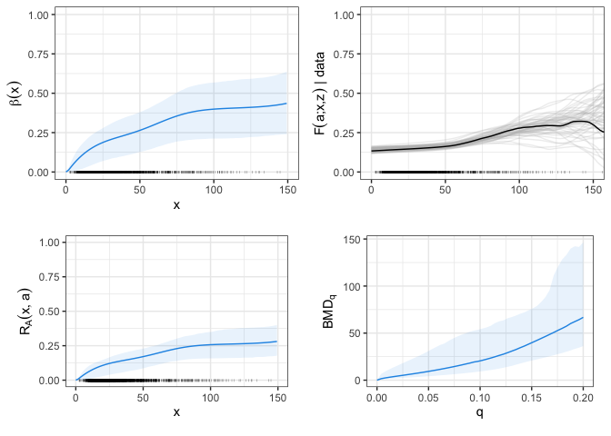
